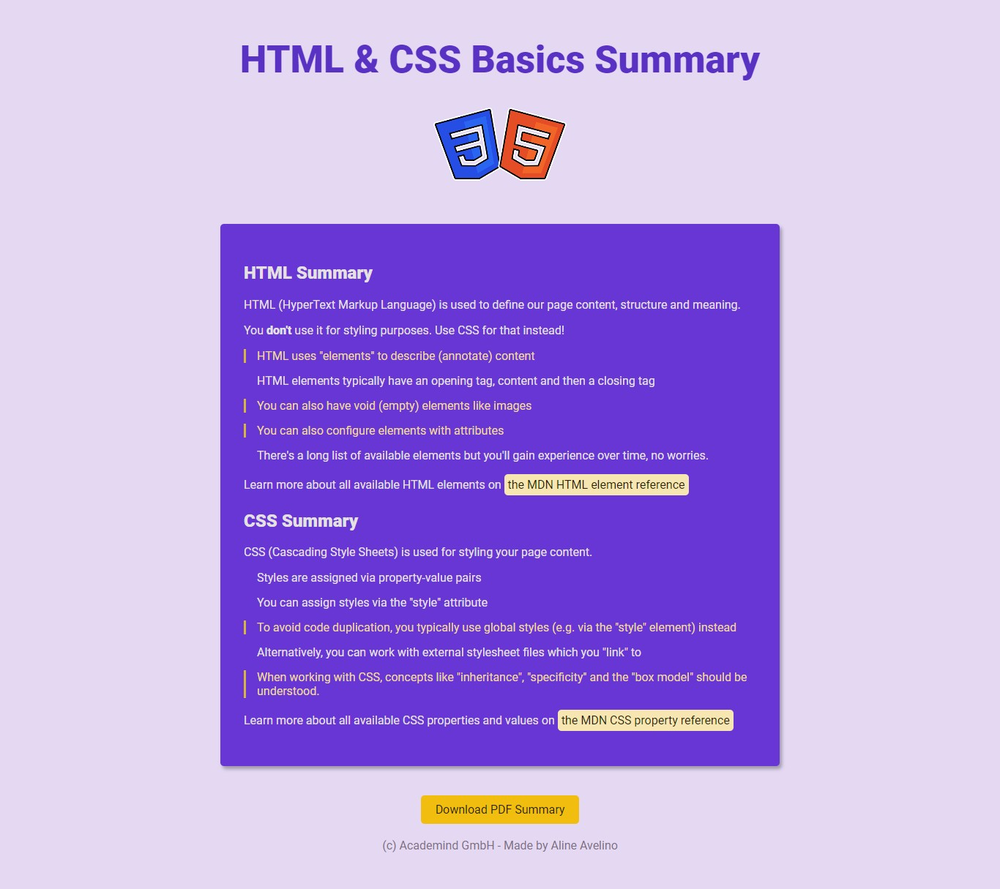

# 📚 100 Days Of Code - Basics summary

> Nesse projeto foram estudados os conceitos de estrutura do HTML, principalmente aplicando elementos semânticos.
> 
> 
> Além disso, foram vistos o conceito de herança, especificidade e como o box model do CSS funciona.
> 
> *Status: concluído.*
> 

## 🖼️ Screenshot


## ✅ O que foi feito

- [x]  Lista com resumo sobre HTML
- [x]  Lista com resumo sobre CSS
- [x]  Link para a documentação do MDN
- [x]  Botão para baixar PDF de resumo

## 🚀 Tecnologias utilizadas

- HTML
- CSS

## 💻 Como rodar

1. Clonar o repositório:

```bash
git clone git@github.com:lineavelino/web-development-bootcamp.git
```

1. Entrar na pasta do projeto:

```bash
cd web-development-bootcamp/basics-summary
```

1. Abrir no editor (manualmente ou pela linha de código, como no exemplo):

```bash
code .
```