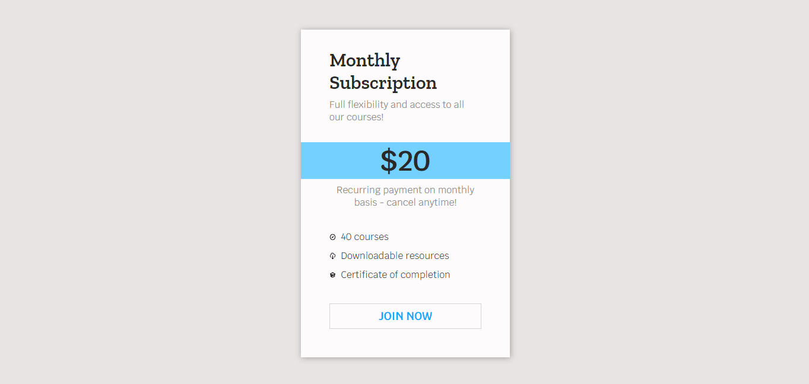

# 📚 100 Days Of Code - Card

> Temas trabalhados nesse projeto: seletor root, svg, criação de variáveis, espaçamento e propriedades transform / transition.
>
> _Status: concluído._

# 🖼️ Screenshot



## ✅ O que foi feito

- [x] Um exemplo de card com informações de preços
- [x] Aplicação da propriedade transform ao passar o mouse por cima do card

## 🚀 Tecnologias utilizadas

- HTML
- CSS

## 💻 Como rodar

1. Clonar o repositório:

```bash
git clone git@github.com:lineavelino/web-development-bootcamp.git
```

2. Entrar na pasta do projeto:

```bash
cd web-development-bootcamp/card-example
```

3. Abrir no editor (manualmente ou pela linha de código, como no exemplo):

```bash
code .
```
