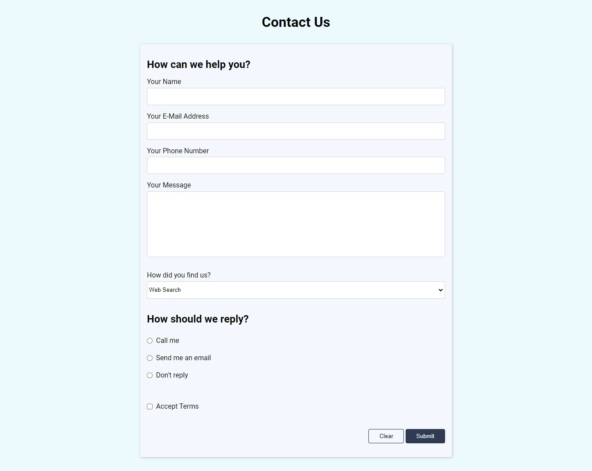

# 📚 100 Days Of Code - Contact form

> Temas trabalhados nesse projeto: criação de formulários, tipos de requisição, input, label, select, form button, validação de formulário, textarea e dropdown
>
> _Status: concluído._

# 🖼️ Screenshot



## ✅ O que foi feito

- [x] Um formulário com informações de contato
- [x] Botão de resetar o formulário
- [x] Botão de submeter
- [x] Validar se campos estão preenchidos

## 🚀 Tecnologias utilizadas

- HTML
- CSS

## 💻 Como rodar

1. Clonar o repositório:

```bash
git clone git@github.com:lineavelino/web-development-bootcamp.git
```

2. Entrar na pasta do projeto:

```bash
cd web-development-bootcamp/contact-form
```

3. Abrir no editor (manualmente ou pela linha de código, como no exemplo):

```bash
code .
```
