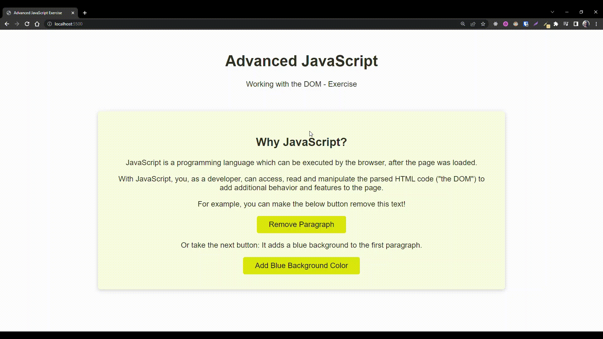

# 📚 100 Days Of Code - Practice what you learned!

> Temas trabalhados nesse projeto: diferentes formas de seleção de elementos HTML com JavaScript, estilização, inserção de event listeners e navegação na árvore de elementos DOM
>
> _Status: concluído._

# 🖼️ Screenshot



## ✅ Instruções do exercício

- [x] 1. Selecione os dois elementos `<button>` e os armazene em duas variáveis diferentes.

  - Selecione o primeiro botão sem adicionar ou usar "id"
  - Selecione o segundo botão usando um "id"

- [x] 2. Adicione o event listener de "click" em ambos os botões (usando duas funções diferentes).
     As funções devem usar "console.dir()" para mostrar os botões clicados.

  - Saída do primeiro botão usando a variável em que está armazenado
  - Saída do segundo botão SEM usar a variável em que está armazenado

- [x] 3. Agora selecione e armazene o primeiro e terceiro parágrafo

  - Selecione AMBOS os parágrafos "navegando" o documento para o
    elementos mencionados

- [x] 4. Altere as funções de (2) para que:

  - O primeiro botão remova o terceiro parágrafo (ou seja, o `<p>` antes dele)
  - O segundo botão altere a cor de fundo do primeiro parágrafo para azul

- [x] 5. Resolva (4) alterando os "estilos inline" e adicionando classes CSS

## 🚀 Tecnologias utilizadas

- HTML
- CSS
- JavaScript

## 💻 Como rodar

1. Clonar o repositório:

```bash
git clone git@github.com:lineavelino/web-development-bootcamp.git
```

2. Entrar na pasta do projeto:

```bash
cd web-development-bootcamp/dom-exercise
```

3. Abrir no editor (manualmente ou pela linha de código, como no exemplo):

```bash
code .
```
