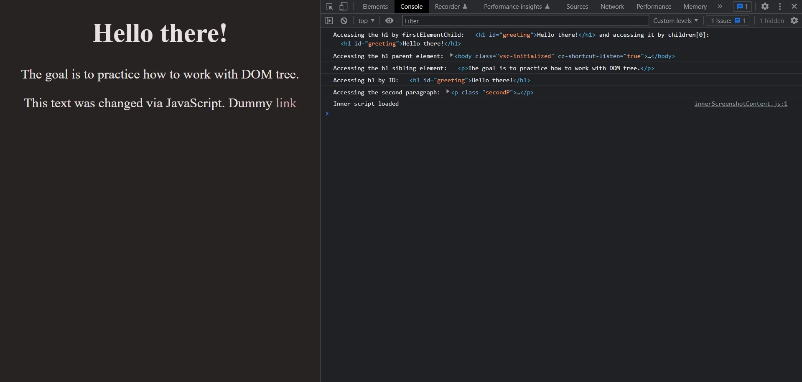

# Exercise Time!

1. Select the `<h1>` element by "drilling into the DOM" and save it in a variable with a name of your choice

2. Use the variable from (1) and get access to the "parent"element of the stored `<h1>` element (i.e. to the `<body>` element)

   BONUS: Try using the variable from (1) to get access to the sibling element (i.e. the `
` element next to the `<h1>` element)

3. Select the `<h1>` element with getElementById and store in the same or a new variable (up to you)

4. Select the second `
` element with querySelector (you might need to add something in the HTML code, e.g. a class) and store it in a new variable with a name of your choice

5. BONUS TASK: Try changing the text content of the `
` element you selected in (4) and set it to any other text of your choice

