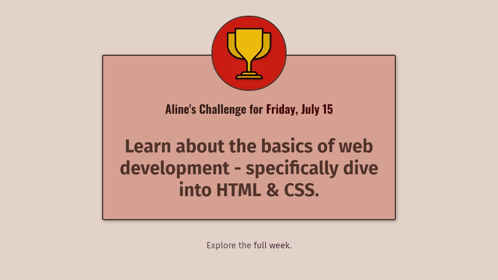
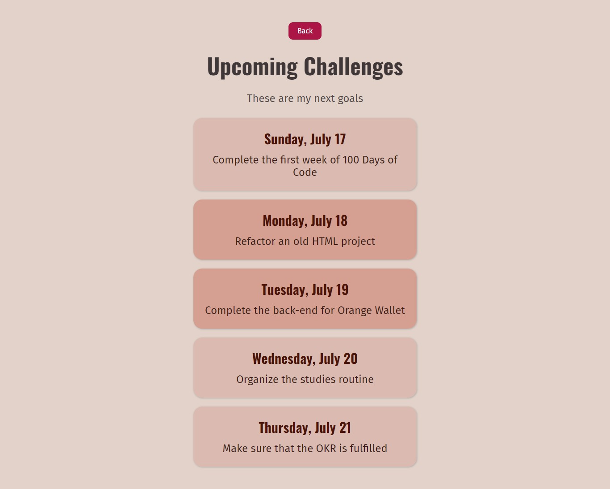

# 📚 100 Days Of Code - Personal challenge

> Nesse projeto foi visto como importar fontes, linkar outros arquivos CSS e páginas HTML, compartilhar um arquivo CSS com mais de uma página, fazer deploy usando Netlify, dentre outros conceitos.
>
>*Status: concluído.*
> 

# 🖼️ Screenshot





[Acesse aqui](https://helpful-cheesecake-d22a77.netlify.app/index.html)

## ✅ O que foi feito

- [x]  Página inicial com o desafio de um dia específico
- [x]  Segunda página com lista de desafios para uma semana
- [x]  Destaque de apenas 2 itens da lista
- [x]  Link de voltar para a página inicial
- [x]  Deploy usando Netlify

## 🚀 Tecnologias utilizadas

- HTML
- CSS

## 💻 Como rodar

1. Clonar o repositório:

```bash
git clone git@github.com:lineavelino/web-development-bootcamp.git
```

2. Entrar na pasta do projeto:

```bash
cd web-development-bootcamp/personal-challenge
```

3. Abrir no editor (manualmente ou pela linha de código, como no exemplo):

```bash
code .
```
