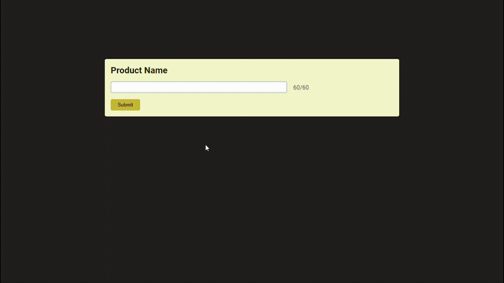

# 📚 100 Days Of Code - Estruturas condicionais

> Temas trabalhados nesse projeto: uso de querySelector, event listener e manipulação do CSS através do JavaScript.
>
> _Status: concluído._

# 🖼️ Screenshot



## ✅ O que foi feito

- [x] Input com limite de caracteres
- [x] Contagem de caracteres em tempo de digitação
- [x] Alteração de estilo dinamicamente

## 🚀 Tecnologias utilizadas

- HTML
- CSS
- JavaScript

## 💻 Como rodar

1. Clonar o repositório:

```bash
git clone git@github.com:lineavelino/web-development-bootcamp.git
```

2. Entrar na pasta do projeto:

```bash
cd web-development-bootcamp/product-input
```

3. Abrir no editor (manualmente ou pela linha de código, como no exemplo):

```bash
code .
```
