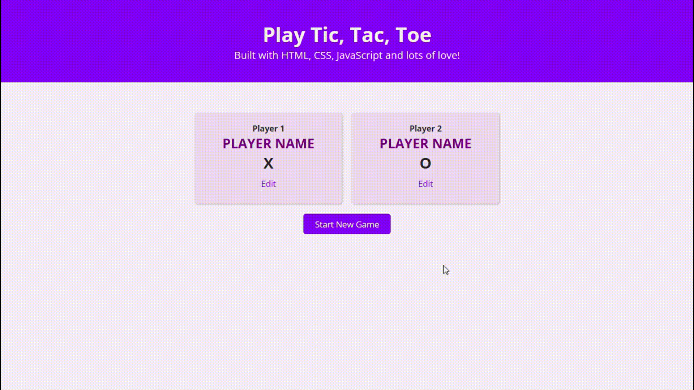

# 📚 100 Days Of Code - Tic tac toe

> Temas trabalhados nesse projeto: manipulação do CSS através do JavaScript e da árvore DOM.
>
> _Status: concluído._

# 🖼️ Screenshot



## ✅ O que foi feito

- [x] Criação de modal para edição de nome dos players
- [x] Verificação se os nomes estão preenchidos
- [x] Tabuleiro para o jogo da velha
- [x] Verificação de vencedor ou empate
- [x] Botão para iniciar / reiniciar o jogo

## 🚀 Tecnologias utilizadas

- HTML
- CSS
- JavaScript

## 💻 Como rodar

1. Clonar o repositório:

```bash
git clone git@github.com:lineavelino/web-development-bootcamp.git
```

2. Entrar na pasta do projeto:

```bash
cd web-development-bootcamp/tic-tac-toe
```

3. Abrir no editor (manualmente ou pela linha de código, como no exemplo):

```bash
code .
```
