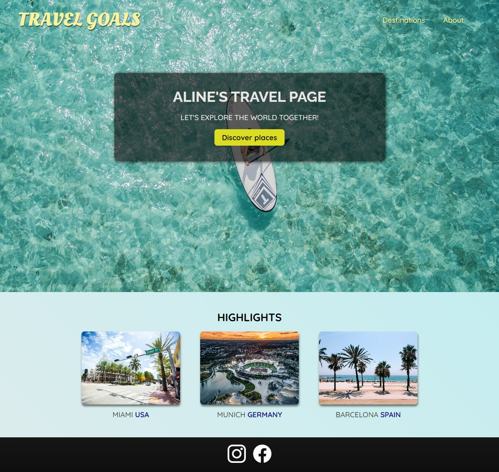
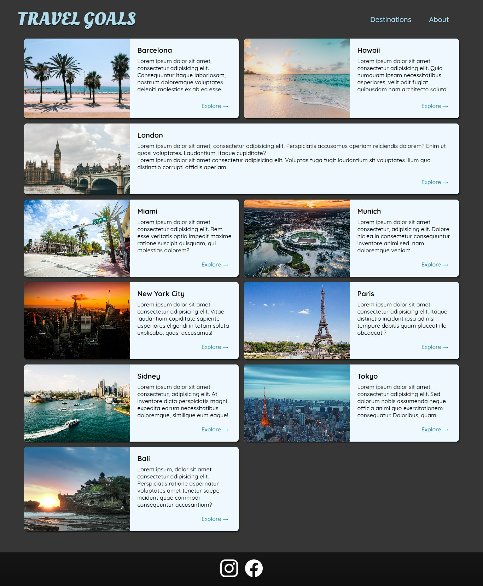

# 📚 100 Days Of Code - Travel page

> Alguns temas trabalhados nesse projeto: display absolute, background image, display relative, flexbox, grid, box shadow, unicode utf-8, % units, position static, nth type.
>
> _Status: concluído._

# 🖼️ Screenshot





## ✅ O que foi feito

- [x] Landpage com imagem de fundo ocupando 2 espaços (header e main)
- [x] Página com a lista de lugares e respectivos links para o Wikipedia

## 🚀 Tecnologias utilizadas

- HTML
- CSS

## 💻 Como rodar

1. Clonar o repositório:

```bash
git clone git@github.com:lineavelino/web-development-bootcamp.git
```

1. Entrar na pasta do projeto:

```bash
cd web-development-bootcamp/travel-page
```

1. Abrir no editor (manualmente ou pela linha de código, como no exemplo):

```bash
code .
```
