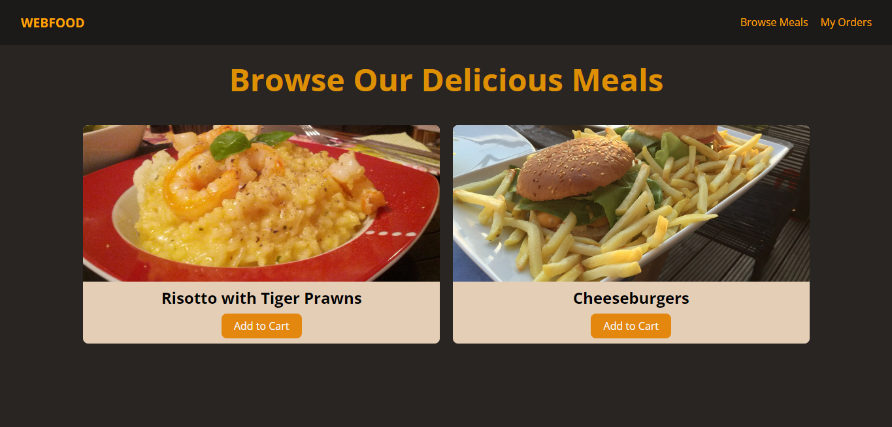
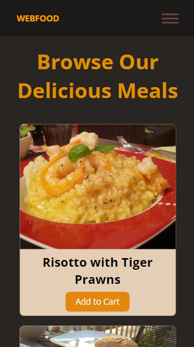
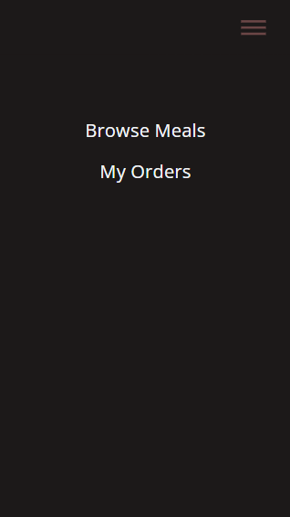

# 📚 100 Days Of Code - Webfood

> Temas trabalhados nesse projeto: responsividade, %, em, rem, mobile first, media queries, breakpoints, min e max-width, links internos e pseudo seletor target.
>
> _Status: concluído._

# 🖼️ Screenshot



|                                           |                                           |
| ----------------------------------------- | ----------------------------------------- |
|  |  |

## ✅ O que foi feito

- [x] Landpage com imagens de produtos
- [x] Responsividade e menu hamburguer

## 🚀 Tecnologias utilizadas

- HTML
- CSS

## 💻 Como rodar

1. Clonar o repositório:

```bash
git clone git@github.com:lineavelino/web-development-bootcamp.git
```

1. Entrar na pasta do projeto:

```bash
cd web-development-bootcamp/webfood
```

1. Abrir no editor (manualmente ou pela linha de código, como no exemplo):

```bash
code .
```
